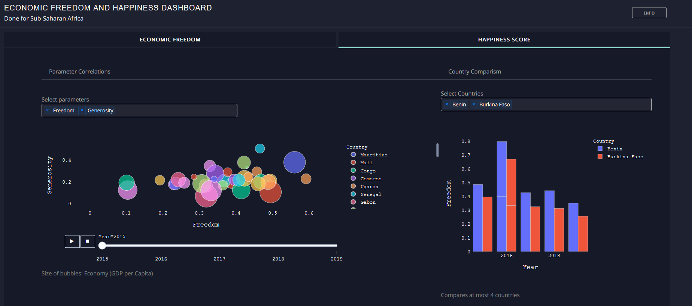
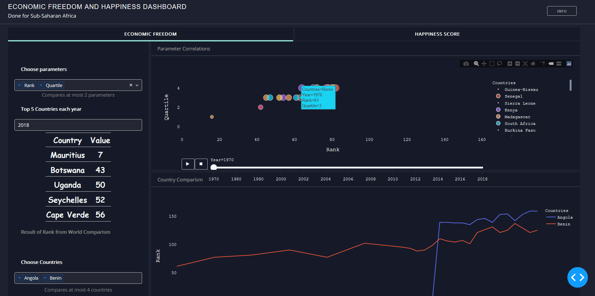

# Economic Freedom and Happiness Score Dashboard

## Introduction
This is a dashboard for to explain the economic freedom and happiness score in Sub-Saharan Africa
## Screenshots

## Built With
* [Dash](https://dash.plot.ly/) - Main server and interactive components 
* [Plotly Python](https://plot.ly/python/) - Used to create the interactive plots

## Requirements
We suggest you to create a separate virtual environment running Python 3 for this app, and install all of the required dependencies there. Run in Terminal/Command Prompt:
### Explanation of this dashboard
In this dashbord, you can explore the different Sub-Saharan African countries performance in these areas.

#### Economic Freedom Tab
This is measured with different parameters. This score shows explains the economic potential for business and growth of a country.
The data for this study was taken from Economic Freedom by Fraser Institution.

To get understanding about the parameters, check https://www.fraserinstitute.org/sites/default/files/economic-freedom-of-the-world-2019-appendix.pdf

- Choose parameters to project the comparism of these parameters on first graph
- Select year to view top 5 countries of the first parameter chosen
- Choose up to 4 countries to compare their yearly values of the first parameter chosen

#### Happiness score Tab
This is a measure of a country to provide wellness to its citizen based of certain parameters which economic freedom is one.

Download the data from Kaggle: https://www.kaggle.com/unsdsn/world-happiness?select=2019.csv

- Choose parameters to project the comparism of these parameters on first graph
- Choose up to 4 countries to compare their yearly values of the first parameter chosen
